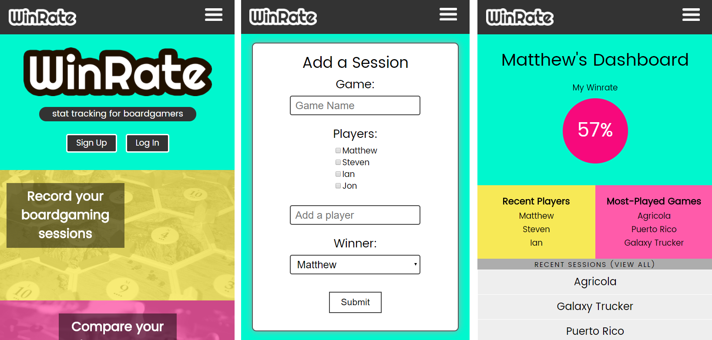

# WinRate

WinRate is a responsive, full-stack app that lets users journal their board-gaming sessions and view statistics about their gaming history.

## Getting Started
This repo contains the front-end (React) part of the WinRate app. The back-end (Node, MongoDB) is located [here](https://github.com/MattLong87/winrate-api).

### Installation
1. `git clone https://github.com/MattLong87/winrate-client.git`
2. `cd winrate-client`
3. `npm install`

### Launching
`npm start`

The app should launch automatically and be live at [localhost:3000](localhost:3000).

### Testing
`npm test`

## Introduction
Board games are a great hobby for spending time with friends and family. However, after a session is over, there's no record of who played or who won - that data is simply lost. WinRate allows users to log their board gaming sessions, including the game played, the names of the players, and the winner.

## Design and Development
As this was my first full-stack React app, I documented each step of the process.
### Initial Design
I began by making an inventory of screens that the user would encounter in this first, "MVP" iteration of the app.
* Landing page
* Navbar
* Account signup page
* Login page
* User's dashboard
* User's session history
* Add session page

Next, for each screen, I coded a basic mobile-first [HTML wireframe](http://bradfrost.com/blog/post/html-wireframes/) and identified [user flows](https://signalvnoise.com/posts/1926-a-shorthand-for-designing-ui-flows) to determine how the user would interact with elements of each screen and the expected resultant behavior.

### React Client
The next step was to translate the wireframes into a static React app to get feedback and make any necessary changes to the structure of the app. Using Facebook's guidelines for [thinking in React](https://facebook.github.io/react/docs/thinking-in-react.html), I identified parts of the app that should be broken into their own components.

### Feedback and Iteration
Once I had a working, interactive version of the app, I was able to collect some feedback from users. I asked two friends to give it a try, and restructured some parts to make it easier to understand.

### Developing the API
I developed the [back-end API](https://github.com/MattLong87/winrate-api) for WinRate using NodeJS with ExpressJS and MongoDB. I wrote endpoints and tests for authenticating users using tokens, creating users, logging in, adding sessions, and deleting sessions.

### Completing the Client
Finally, I connected the API to the React client, using Redux for state management, and implemented a fully functional version of the app. I wrote tests for each component, action, and the Redux reducer, and ensured the app was responsive on both mobile and desktop.

### Roadmap for v2
* Improve WinRate calculation! Currently does not account for the number of players in a game
* Additional user features such as deleting account, forgot password functionality
* More statistics: Which games haven't you played in a while? WinRates per game, instead of overall
* Linking with a third-party API, such as [BoardGameGeek](http://www.boardgamegeek.com)